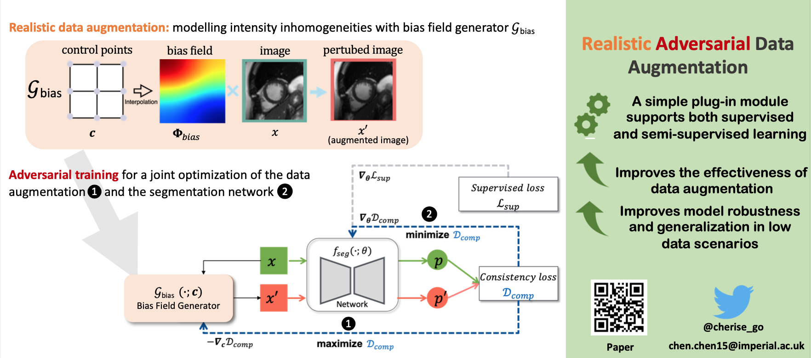

# Adversarial Bias Field Data Augmentation (Adv Bias)

This repo contains the pytorch implementation of adversarial bias field augmentation, which supports both 2D and 3D images.
Please cite our work if you find it useful in your work

## Introduction

We propose an adversarial data augmentation method for training neural networks for medical image segmentation. Instead of generating pixel-wise adversarial attacks, our model generates plausible and realistic signal corruptions, which models the intensity inhomogeneities caused by a common type of artefacts in MR imaging: bias field. The proposed method does not rely on generative networks, and can be used as a plug-in module for general segmentation networks in both supervised and semi-supervised learning.


For more details please see our [MICCAI 2020 paper](https://arxiv.org/abs/2006.13322) and [Youtube Video](https://youtu.be/-ICKhtkxY-4).

## Requirements

- numpy
- torch
- SimpleITK
- scikit-image
- seaborn ## for visualization
- matplotlib ## for visualization

## Set Up

1.  Install PyTorch and other required python libraries with:
    ```
    pip install -r requirements.txt
    ```
2.  Play with the provided jupyter notebook to check the enviroments

## Usage

1. Please ref to Sec. 4.1 and Sec 4.2 in the jupyter notebook: "adv_bias_field_generation.ipynb" to see how to plug in our module to support supervised/semi-supervised learning.
2. You can also clone this probject as submodule in your project.

- Add submodule:
  ```
  git submodule add https://github.com/cherise215/AdvBias.git
  ```
- Add the lib path to the file where you import our library:
  ```
  sys.path.append($change_it_to_our_project's_local_path_in_your_project$)
  import advbias as advbias
  ```

## Citation

If you find this useful for your work, please consider citing

```
@INPROCEEDINGS{Chen_MICCAI_2020_Realistic,
  title     = "Realistic Adversarial Data Augmentation for {MR} Image
               Segmentation",
  booktitle = "Medical Image Computing and Computer Assisted Intervention --
               {MICCAI} 2020",
  author    = "Chen, Chen and Qin, Chen and Qiu, Huaqi and Ouyang, Cheng and
               Wang, Shuo and Chen, Liang and Tarroni, Giacomo and Bai, Wenjia
               and Rueckert, Daniel",
  publisher = "Springer International Publishing",
  pages     = "667--677",
  year      =  2020
}

```
